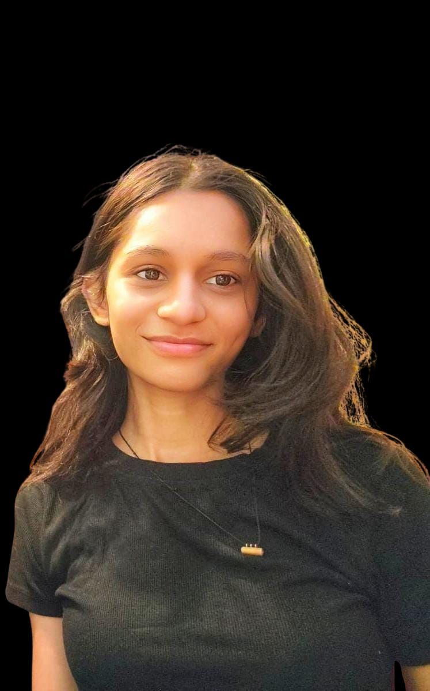
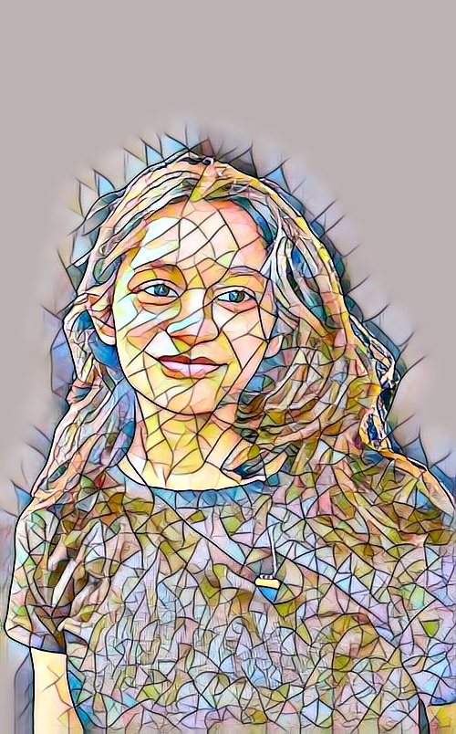

# StyleGenie - Fast Neural Style Transfer

A PyTorch implementation of fast neural style transfer using feed-forward networks. Transform any image into a work of art in real-time using pre-trained style models.

## Demo

<p align="center">



</p>

<p align="center">
<i>Content Image → Style Image → Stylized Output</i>
</p>

## Features

- Fast feed-forward neural style transfer
- Pre-trained models for instant stylization
- Custom model training on your own style images
- GPU and CPU support
- Batch processing capabilities
- TensorBoard integration for training monitoring

## Quick Start

### Installation

```bash
# Clone the repository
git clone https://github.com/Unicornimpersonated/StyleGenie.git
cd StyleGenie

# Install dependencies
pip install -r requirements.txt
```

### Stylize Images

```bash
# Download pre-trained models
python utils/resource_downloader.py

# Stylize a single image
python stylization_script.py --content_input Aneri.jpg --model_name mosaic_4e5_e2.pth

# Batch stylization (entire directory)
python stylization_script.py --content_input /path/to/images/ --batch_size 10
```

## Project Structure

```
StyleGenie/
├── data/
│   ├── content-images/      # Input images
│   ├── style-images/        # Style reference images
│   └── output-images/       # Generated stylized images
├── models/
│   ├── definitions/         # Network architectures
│   │   ├── transformer_net.py
│   │   └── perceptual_loss_net.py
│   ├── binaries/           # Trained model weights
│   └── checkpoints/        # Training checkpoints
├── utils/
│   ├── utils.py            # Helper functions
│   └── resource_downloader.py
├── stylization_script.py   # Inference script
└── training_script.py      # Training script
```

## Training Your Own Models

### 1. Download Training Dataset

```bash
# Download MS COCO dataset (~12.5 GB)
python utils/resource_downloader.py -r mscoco_dataset
```

### 2. Train a Model

```bash
python training_script.py --style_img_name mosaic.jpg --style_weight 4e5
```

### Key Training Parameters

- `--style_img_name`: Name of style image in `data/style-images/`
- `--style_weight`: Style loss weight (recommended: 1e5 to 9e5)
- `--content_weight`: Content loss weight (default: 1.0)
- `--tv_weight`: Total variation loss weight (default: 0)
- `--num_of_epochs`: Number of training epochs (default: 2)
- `--subset_size`: Number of MS COCO images to use (default: all ~83k)

### 3. Monitor Training with TensorBoard

```bash
tensorboard --logdir=runs --samples_per_plugin images=50
```

Open http://localhost:6006/ to view:
- Loss curves (content, style, total variation)
- Image statistics (min/max/mean/median)
- Intermediate stylized outputs

## Model Architecture

### TransformerNet
- **Encoder**: 3 convolutional layers with instance normalization
- **Residual Network**: 5 ResNet-style residual blocks
- **Decoder**: Upsampling layers with nearest-neighbor interpolation

### PerceptualLossNet (VGG16)
- Pre-trained VGG16 for perceptual loss computation
- Extracts features from layers: relu1_2, relu2_2, relu3_3, relu4_3
- Used for both content and style loss calculation

## Advanced Usage

### Custom Image Width

```bash
python stylization_script.py --content_input image.jpg --img_width 800
```

### Verbose Mode

```bash
python stylization_script.py --content_input image.jpg --verbose
```

This displays:
- Model training metadata
- Git commit hash
- Hyperparameters used during training
- Output save location

### Training with Custom Parameters

```bash
python training_script.py \
  --style_img_name candy.jpg \
  --style_weight 3e5 \
  --content_weight 1.0 \
  --tv_weight 0 \
  --num_of_epochs 3 \
  --subset_size 40000 \
  --enable_tensorboard
```

## How It Works

1. **Content Image** passes through TransformerNet → **Stylized Image**
2. Both images pass through VGG16 (PerceptualLossNet)
3. **Content Loss**: MSE between relu2_2 features
4. **Style Loss**: MSE between Gram matrices of multiple layers
5. **Total Loss** = Content Loss + Style Loss + TV Loss
6. Backpropagate and update TransformerNet weights

## Troubleshooting

### Loss Spike During Training
- Try re-running the training (optimizer may have entered bad state)
- Lower the `--style_weight` parameter

### Out of Memory
- Reduce `--batch_size` in stylization script
- Lower `--img_width` for smaller image dimensions
- Use CPU mode if GPU memory is insufficient

### Check Model Metadata
```bash
python stylization_script.py --content_input image.jpg --verbose
```

## Requirements

- Python 3.8+
- PyTorch 2.5.0+
- torchvision 0.20.0+
- OpenCV 4.10.0+
- NumPy 2.1.0+
- TensorBoard 2.18.0+

See [requirements.txt](requirements.txt) for complete dependencies.

## Performance

- **Training Time**: ~2-4 hours on GPU for 2 epochs with full MS COCO dataset
- **Inference Time**: Real-time (milliseconds per image on GPU)
- **Model Size**: ~7 MB per trained model

## References

Based on the paper:
- **Perceptual Losses for Real-Time Style Transfer and Super-Resolution**
  - Justin Johnson, Alexandre Alahi, Li Fei-Fei
  - [arXiv:1603.08155](https://arxiv.org/pdf/1603.08155.pdf)

Improvements from:
- Instance Normalization: [Ulyanov et al.](https://arxiv.org/pdf/1607.08022.pdf)
- Upsampling Method: [Distill Pub](http://distill.pub/2016/deconv-checkerboard/)

## License

MIT License - see [LICENCE](LICENCE) file for details

## Contributing

Contributions are welcome! Please feel free to submit a Pull Request.

## Acknowledgments

- MS COCO dataset for training images
- PyTorch team for the framework
- Original neural style transfer research by Gatys et al.